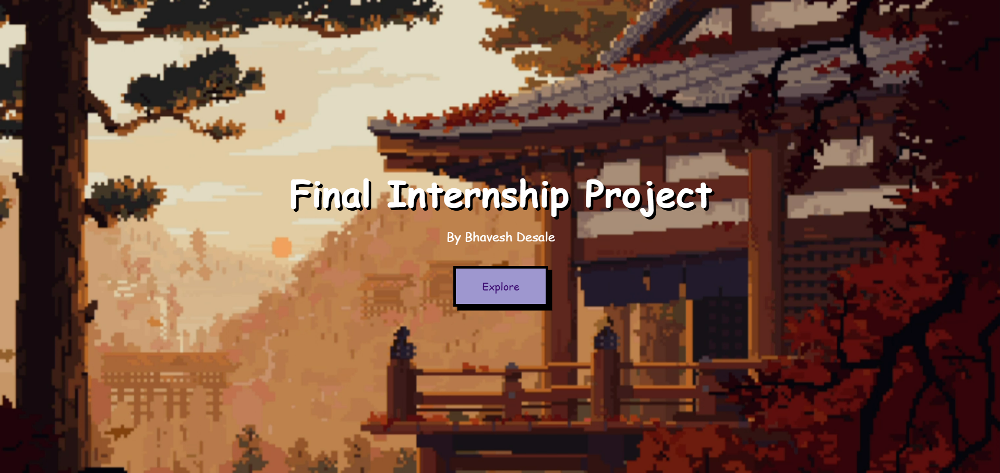
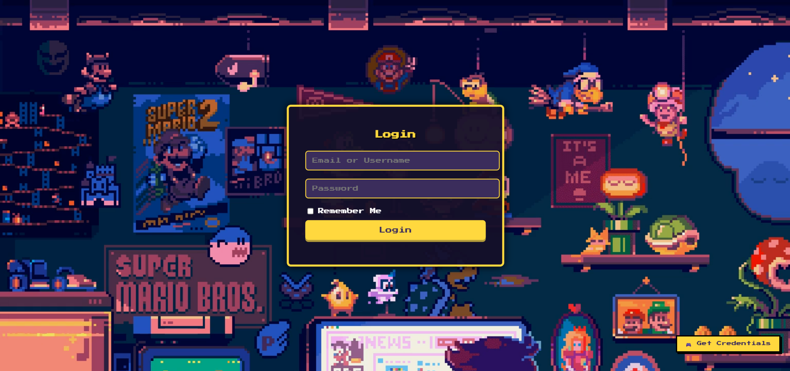

# 🔐 Login Page - Final Internship Project

Welcome to the **Pixel-Themed Animated Login Page** built as the final internship project for **Celebal Technologies**.

---

### 🚀 Features
-  Retro pixel-styled UI with animated transitions  
-  Video background for immersive landing  
-  Username & password login with validation  
-  Password strength checker (zxcvbn.js)  
-  Success & error sounds  
-  "Remember Me" functionality  
-  Auto lockout after 3 wrong attempts (with countdown)  
-  Get credentials card for demo/testing  
-  Responsive and mobile-friendly  
-  Back button logic to return from redirected site  

---

### 🔗 Live Demo
🌐 [View Live Project](https://your-live-url-here.com)  

---

### 🧪 Dummy Login Credentials
**Username:** `celebal`  
**Password:** `celebal@2025`

---

### 📂 Tech Stack
- **HTML, CSS, JavaScript**  
- **Zxcvbn.js** – Password strength estimation  
- **SweetAlert2** – Alert modals  
- **localStorage API** – Remember Me + Lockout persistence  

---

### 📸 Demo Screenshots
#### 🎮 Landing Page

#### 🔐 Login Form

---

### 📦 Developed By
**Bhavesh Desale**
